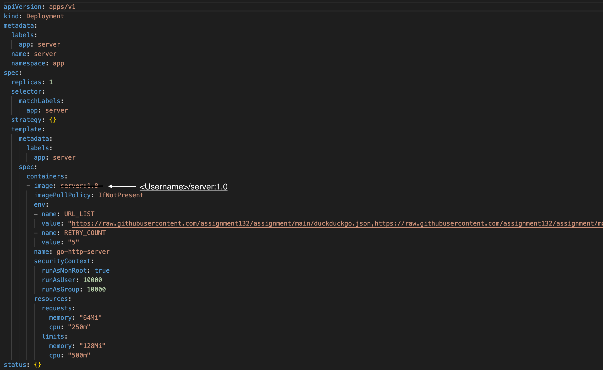

# HTTP Server written in Golang

## Prerequisites

- Golang
- Docker
- Kubernetes
- Docker Hub Account

## Steps to run the server locally

- Run the following commands to install dependencies:

  ```bash
  go mod download
  ```

  ```bash
  go mod verify
  ```

- Set the `URL_LIST` and `RETRY_COUNT` environment variables. For e.g.

  ```bash
  export URL_LIST=https://raw.githubusercontent.com/assignment132/assignment/main/duckduckgo.json,https://raw.githubusercontent.com/assignment132/assignment/main/google.json,https://raw.githubusercontent.com/assignment132/assignment/main/wikipedia.json
  ```

  ```bash
  export RETRY_COUNT=5
  ```

  Here `URL_LIST` is the comma-separated list of URLs from which data will be retrieved concurrently and `RETRY_COUNT` is the number of attempts that the server will take to retrieve the data if the request fails in the first attempt. In the above example, the server will try 5 times to retrieve the data before it throws an error.

- Run the server using the following command:

  ```bash
  go run main.go
  ```

## Steps to run the unit tests

- Run the following commands to install dependencies:

  ```bash
  go mod download
  ```

  ```bash
  go mod verify
  ```

- Run the following to run the unit tests:

  ```bash
  go test ./... -v -coverprofile cover.out
  ```

## Steps to run the server in Docker container

- Run the following command to build the Docker image:

  ```bash
  docker build -t server:1.0 .
  ```

- Run the following command to start the Docker container:

  ```bash
  docker run -d -p 9090:9090 \
  -e URL_LIST='https://raw.githubusercontent.com/assignment132/assignment/main/duckduckgo.json,https://raw.githubusercontent.com/assignment132/assignment/main/google.json,https://raw.githubusercontent.com/assignment132/assignment/main/wikipedia.json' \
  -e RETRY_COUNT='5' \
  --name server \
  server:1.0
  ```

- Run the following command to call the server's `/api/v1/websites` GET API:

  ```bash
  curl -X GET "http://localhost:9090/api/v1/websites?sortKey=views&limit=5"
  ```

  You should get the response in the below format. Data might vary as the server fetches the data from the different URLs concurrently.

  ```json
  {
   "data": [
     {
       "url": "www.example.com/abc1",
       "views": 1000,
       "relevanceScore": 0.1
     },
     {
       "url": "www.example.com/abc2",
       "views": 2000,
       "relevanceScore": 0.2
     },
     {
       "url": "www.example.com/abc3",
       "views": 3000,
       "relevanceScore": 0.3
     },
     {
       "url": "www.example.com/abc4",
       "views": 4000,
       "relevanceScore": 0.4
     },
     {
       "url": "www.example.com/abc5",
       "views": 5000,
       "relevanceScore": 0.5
     }
   ],
   "count": 5
  }
  ```

## Steps to deploy the server in Kubernetes

- Log in to [Docker Hub](https://hub.docker.com/) by running the following command:

   ```bash
   docker login -u <Username>
   ```

  Where:
  - `<Username>` is the username to log in to the docker hub.

- Run the following command to build the Docker image:

  ```bash
  docker build -t server:1.0 .
  ```

- Run the following command to Tag the Docker image:

  ```bash
  docker tag server:1.0 <Username>/server:1.0
  ```

  Where:
  - `<Username>` is the username to log in to the docker hub.

- Run the following command to push the Docker image to the Docker Hub:

   ```bash
   docker push <Username>/server:1.0
   ```

  Where:
  - `<Username>` is the username to log in to the docker hub.

- Update the value of `image` field in `./deploy/deployment.yaml` with the `<Username>/server:1.0`

  Where:
  - `<Username>` is the username to log in to the docker hub.

  Note: In case you don't want to build and push the Docker image into your account then you can update the value of the `image` field in `./deploy/deployment.yaml` with the `developersthought/server:1.0`, I have already built and pushed the image to my Docker Hub account.

  

- Run the following command to deploy the server in Kubernetes:

  ```bash
  kubectl apply -f ./deploy/namespace.yaml
  ```

  ```bash
  kubectl apply -f ./deploy/deployment.yaml
  ```

  ```bash
  kubectl apply -f ./deploy/service.yaml
  ```

  Verify that server Pod is started successfully by running the following command:

  ```bash
  kubectl get po -n app
  ```

- Run the following command to call the server's `/api/v1/websites` GET API:

  ```bash
  curl -X GET "http://<Worker Node Public IP Address>:30000/api/v1/websites?sortKey=views&limit=5"
  ```

  Where:
  - `<Worker Node Public IP Address>` is the Public IP Address of any of the Kubernetes Worker Node.

  You should get the response in the below format. Data might vary as the server fetches the data from the different URLs concurrently.

  ```json
  {
   "data": [
     {
       "url": "www.example.com/abc1",
       "views": 1000,
       "relevanceScore": 0.1
     },
     {
       "url": "www.example.com/abc2",
       "views": 2000,
       "relevanceScore": 0.2
     },
     {
       "url": "www.example.com/abc3",
       "views": 3000,
       "relevanceScore": 0.3
     },
     {
       "url": "www.example.com/abc4",
       "views": 4000,
       "relevanceScore": 0.4
     },
     {
       "url": "www.example.com/abc5",
       "views": 5000,
       "relevanceScore": 0.5
     }
   ],
   "count": 5
  }
  ```